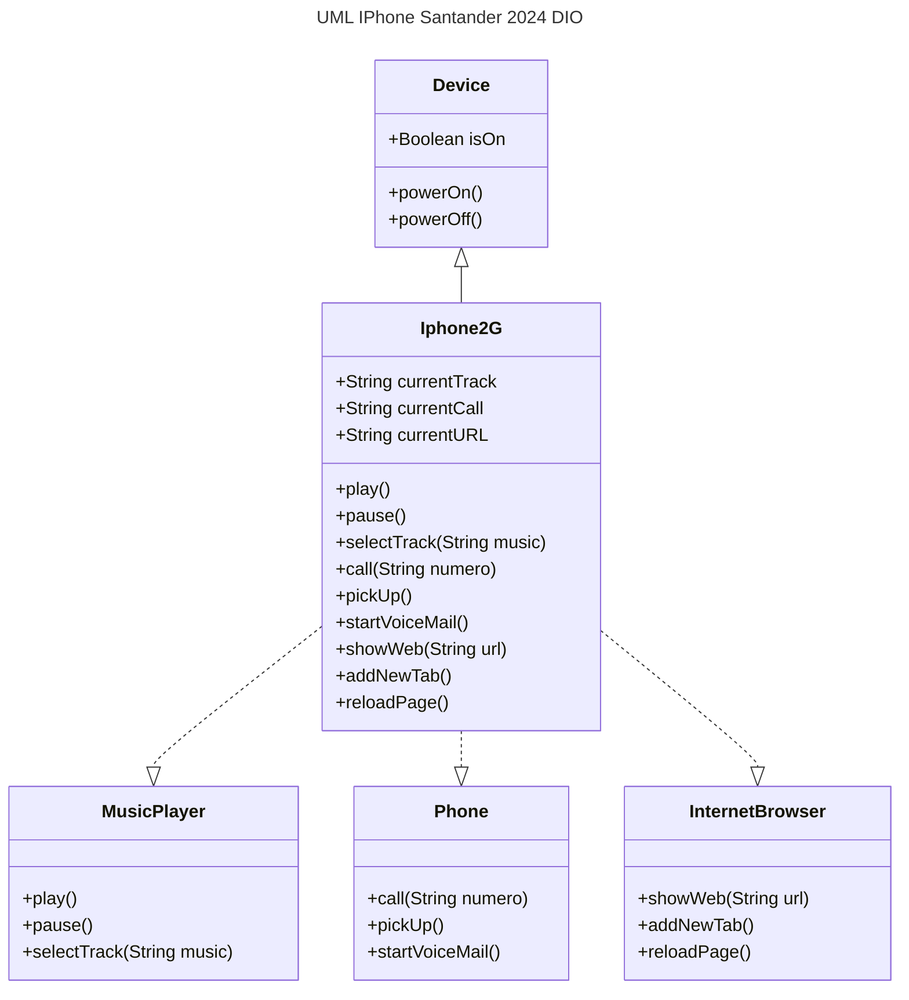

# Desafio Criação de UML no Mermaid - Santander 2024 - DIO - Trilha Java

## Link da foto do uml

link -> https://www.mermaidchart.com/raw/4923c05e-7a68-4f55-9df1-b78c68f093dc?theme=light&version=v0.1&format=svg

## UML 
Foi utilizado o conceito de herança e também de interfaces para que o iphone pudesse ser multifuncional herdando apenas de um device genérico.

## Código

Código fonte está aqui -> https://github.com/AdalbertoBrant2024/dio-trilha-java-basico/tree/main/Iphone2GSimulator/src/iphone2gsimulator
